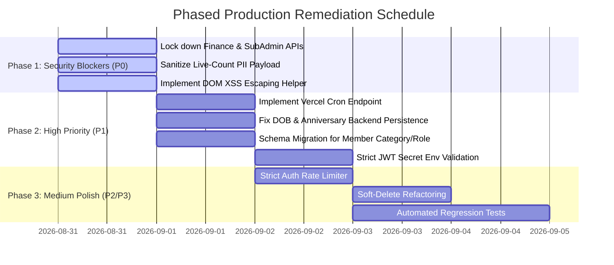

Listed directory api
Viewed %5B...path%5D.js:1-6
Viewed app.js:1-34
Viewed celebrations.routes.js:1-35
Viewed reminders.routes.js:1-16
Listed directory jobs
Viewed reminders.job.js:1-14
Viewed error.js:1-6
Viewed health.routes.js:1-5
Viewed server.js:1-7

# FULL PROJECT CODE AUDIT REPORT
**System:** Solutions Faith Ministry International — Church Management & Kiosk Check-In Platform  
**Target Codebase:** Fullstack (Express.js / Prisma ORM / PostgreSQL / Vanilla JS / Vercel Serverless)  
**Audit Scope:** End-to-End Codebase, Security, Database Integrity, Role-Based Access Control, Workflows, APIs, and Production Readiness  
**Audit Mode:** READ-ONLY COMPREHENSIVE ASSESSMENT (Zero Production Code Modified)

---

## EXECUTIVE SUMMARY & PRODUCTION READINESS VERDICT

### Production Release Verdict: **NO-GO** 🛑

The application provides a robust UI layout, live Kiosk attendance synchronization, and functional PostgreSQL persistence. However, it **cannot be approved for open production deployment in its current state** due to **several Critical (P0) security vulnerabilities**: unauthenticated financial endpoints, unauthenticated sub-administrator management endpoints, sensitive personal data exposure, stored XSS risks in administrative tables, and serverless cron limitations.

| Metric | Score (0–100) | Status | Assessment Summary |
| :--- | :---: | :---: | :--- |
| **Overall Project Health** | **74 / 100** | ⚠️ Conditional | Functional core flows with critical security gaps |
| **Security & Access Control** | **52 / 100** | 🛑 Critical Risk | Critical endpoints lack authentication/authorization |
| **Architecture & Serverless** | **78 / 100** | ⚠️ Needs Refinement | Good separation; background jobs decoupled on Vercel |
| **Database & Schema Integrity** | **81 / 100** | ⚠️ Minor Mismatches | Solid relational schema; some frontend-only attributes |
| **Role & Permission Enforcement** | **60 / 100** | 🛑 Critical Risk | Backend authorization missing on several admin routes |
| **Production Readiness** | **55 / 100** | 🛑 NO-GO | Remediation required before public/live launch |

---

### Issue Count by Severity
* 🔴 **CRITICAL (P0):** 4 Issues
* 🟠 **HIGH (P1):** 6 Issues
* 🟡 **MEDIUM (P2):** 7 Issues
* 🟢 **LOW (P3):** 5 Issues

---

# SECTION 1: DETAILED FINDINGS BY SEVERITY

---

## 🔴 CRITICAL — P0 (Blockers for Production)

---

### Issue ID: `SEC-P0-01`
* **Severity:** CRITICAL (P0)
* **File:** [`backend/src/modules/finance/finance.routes.js`](file:///Users/guyman-gh/Downloads/church-management-production/backend/src/modules/finance/finance.routes.js#L39-L154)
* **Exact Location:** Lines 39–154 (`POST /service-entry`, `GET /service-entries`, `GET /analytics`)
* **Problem:** Crucial financial routes have **zero authentication or authorization middleware** attached.
* **Why it is a problem:** Any anonymous caller on the internet can:
  1. Post fake financial records (`POST /api/v1/finance/service-entry`).
  2. Download raw service finance logs (`GET /api/v1/finance/service-entries`).
  3. Extract full church financial metrics, tithe totals, MoMo collections, cash holdings, and bank deposits (`GET /api/v1/finance/analytics`).
* **How it can be triggered:** Sending a plain `GET https://checkinsolutions.vercel.app/api/v1/finance/analytics` via `curl` or Postman with no headers.
* **Security/Business Impact:** Total disclosure of confidential church financial records and vulnerability to financial ledger tampering.
* **Recommended Fix:** Attach `requireAuth` and `requireRoles('SUPER_ADMIN', 'ADMIN', 'FINANCE')` to all three endpoints.
* **Changes Required:**
  * Database: None
  * Frontend: None (Frontend already sends `Authorization: Bearer <token>`)
  * Backend: Yes (Add middleware to route handlers)
  * Tests: Yes (Unit test verifying HTTP 401/403 without token)

---

### Issue ID: `SEC-P0-02`
* **Severity:** CRITICAL (P0)
* **File:** [`backend/src/modules/auth/auth.routes.js`](file:///Users/guyman-gh/Downloads/church-management-production/backend/src/modules/auth/auth.routes.js#L148-L230)
* **Exact Location:** Lines 148–230 (`GET /subadmins`, `POST /subadmins`, `PUT /subadmins/:id`, `DELETE /subadmins/:id`)
* **Problem:** Sub-administrator CRUD operations have **zero authentication and role checking**.
* **Why it is a problem:** Any unauthenticated third party can:
  1. Enumerate all sub-admin accounts and their email addresses.
  2. Create new administrative accounts with arbitrary passwords.
  3. Alter existing sub-admin permission sets (Privilege Escalation).
  4. Revoke or delete any administrative account at will.
* **How it can be triggered:** Sending `POST /api/v1/auth/subadmins` with `{ "name": "Attacker", "email": "evil@domain.com", "password": "Pass", "permissions": ["attendance","members","programs","finance"] }` without an authorization header.
* **Security/Business Impact:** Total platform takeover and unauthorized privilege escalation.
* **Recommended Fix:** Attach `requireAuth` and `requireRoles('SUPER_ADMIN')` to all `/subadmins*` endpoints.
* **Changes Required:**
  * Database: None
  * Frontend: None
  * Backend: Yes (Add middleware)
  * Tests: Yes (Verify unauthenticated rejection)

---

### Issue ID: `SEC-P0-03`
* **Severity:** CRITICAL (P0)
* **File:** [`backend/src/modules/attendance/attendance.routes.js`](file:///Users/guyman-gh/Downloads/church-management-production/backend/src/modules/attendance/attendance.routes.js#L111-L165)
* **Exact Location:** Lines 111–165 (`GET /live-count/:serviceId`)
* **Problem:** Unauthenticated endpoint exposes member Personally Identifiable Information (PII) including phone numbers and home addresses.
* **Why it is a problem:** The endpoint is intended to supply real-time stats to the kiosk, but returns full member objects in `recent`: `firstName`, `lastName`, `phone`, `gender`, and `address` to anyone who queries the URL without credentials.
* **How it can be triggered:** Sending `GET /api/v1/attendance/live-count/<serviceId>` returns the residential addresses and phone numbers of church members and first-time visitors.
* **Security/Business Impact:** PII data leak violating standard privacy regulations (GDPR/Data Protection Act).
* **Recommended Fix:** Separate the public live count (which only needs aggregate counts, or last first name/initial) from the administrative attendance feed which requires `requireAuth`.
* **Changes Required:**
  * Database: None
  * Frontend: Update kiosk vs. admin fetch calls
  * Backend: Yes (Sanitize payload for unauthenticated kiosk consumers)
  * Tests: Yes

---

### Issue ID: `SEC-P0-04`
* **Severity:** CRITICAL (P0)
* **File:** [`web/public/admin.html`](file:///Users/guyman-gh/Downloads/church-management-production/web/public/admin.html#L3370-L3420), [`web/public/finance.html`](file:///Users/guyman-gh/Downloads/church-management-production/web/public/finance.html#L750-L780)
* **Exact Location:** Dynamic table row generators (`innerHTML = list.map(m => ...).join('')`)
* **Problem:** Member names, notes, addresses, and transaction references are interpolated directly into DOM `innerHTML` without HTML escaping.
* **Why it is a problem:** If a visitor registers on the kiosk with a malicious payload in their name or address (e.g. `John `), when the administrator opens the Attendance or Member Directory tab, the script executes in the admin's browser session (Stored XSS).
* **How it can be triggered:** Register a visitor with `<svg onload=alert(1)>` in `address` or `lastName`.
* **Security/Business Impact:** Session hijacking, unauthorized API execution using the Super Admin's JWT token.
* **Recommended Fix:** Implement an `escapeHtml(str)` utility function and wrap all dynamic user-provided strings before DOM insertion, or use `textContent` / safe template binding.
* **Changes Required:**
  * Database: None
  * Frontend: Yes (Add HTML escaping across all DOM render functions)
  * Backend: Optional sanitization middleware (e.g., `xss-clean` or DOMPurify)
  * Tests: Yes (XSS payload injection test)

---

## 🟠 HIGH — P1 (Major Operational & Security Issues)

---

### Issue ID: `OPS-P1-01`
* **Severity:** HIGH (P1)
* **File:** [`backend/src/server.js`](file:///Users/guyman-gh/Downloads/church-management-production/backend/src/server.js#L6) vs [`vercel.json`](file:///Users/guyman-gh/Downloads/church-management-production/vercel.json#L8-L15)
* **Exact Location:** `setInterval(() => processReminders().catch(console.error), 60*1000)` in `server.js`
* **Problem:** In serverless deployment (Vercel), `server.js` is never executed; only `api/[...path].js` invokes Express per request.
* **Why it is a problem:** The background reminders cron (`processReminders`) never runs in production. Scheduled celebration reminders and SMS notifications will remain permanently in `PENDING` status.
* **How it can be triggered:** Schedule a celebration reminder; observe that it is never processed on Vercel.
* **Security/Business Impact:** Silent failure of church reminder and notification services.
* **Recommended Fix:** Create a dedicated route `GET /api/v1/jobs/reminders` protected by a secret bearer token or header (`CRON_SECRET`), and configure a Vercel Cron Job in `vercel.json`:
  ```json
  "crons": [{ "path": "/api/v1/jobs/reminders", "schedule": "0 8 * * *" }]
  ```
* **Changes Required:**
  * Database: None
  * Frontend: None
  * Backend: Yes (Add cron endpoint and `vercel.json` cron config)
  * Tests: Yes (Endpoint execution test)

---

### Issue ID: `DATA-P1-02`
* **Severity:** HIGH (P1)
* **File:** [`backend/src/modules/members/members.routes.js`](file:///Users/guyman-gh/Downloads/church-management-production/backend/src/modules/members/members.routes.js#L44-L54)
* **Exact Location:** Lines 44–54 (`prisma.member.create`)
* **Problem:** `dateOfBirth` and `anniversary` fields are omitted during member creation in backend routes.
* **Why it is a problem:** Even though the frontend collects Date of Birth and the database schema supports `dateOfBirth: DateTime?`, the backend handler only extracts `firstName`, `lastName`, `email`, `phone`, `gender`, `address`, `householdId`. Any DOB submitted via the Admin Member Modal is silently dropped by the backend.
* **How it can be triggered:** Add a member with DOB in Admin Portal. Inspect database row; `dateOfBirth` is `null`.
* **Security/Business Impact:** Data loss preventing birthday celebration tracking and age-group demographics.
* **Recommended Fix:** Parse `b.dateOfBirth` and `b.anniversary` into valid `Date` objects if provided in `POST /members` and `PUT /members/:id`.
* **Changes Required:**
  * Database: None
  * Frontend: None
  * Backend: Yes (Update `members.routes.js`)
  * Tests: Yes

---

### Issue ID: `SEC-P1-03`
* **Severity:** HIGH (P1)
* **File:** [`backend/src/modules/auth/auth.routes.js`](file:///Users/guyman-gh/Downloads/church-management-production/backend/src/modules/auth/auth.routes.js#L160-L176)
* **Exact Location:** Lines 160–176 (`GET /user/:email`)
* **Problem:** Unprotected endpoint exposes user account metadata by email without authentication.
* **Why it is a problem:** Any actor can probe email addresses to confirm whether an email belongs to a church administrator, revealing user IDs, roles, and connected member IDs.
* **How it can be triggered:** `GET /api/v1/auth/user/Admin@solutionsfaith.com` returns the account role and internal ID.
* **Security/Business Impact:** User enumeration and reconnaissance for credential stuffing.
* **Recommended Fix:** Enforce `requireAuth` or eliminate the endpoint if covered by `GET /api/v1/auth/me`.
* **Changes Required:**
  * Database: None
  * Frontend: Update any dependent callers to use `/auth/me`
  * Backend: Yes (Protect or deprecate)
  * Tests: Yes

---

### Issue ID: `SEC-P1-04`
* **Severity:** HIGH (P1)
* **File:** [`backend/src/modules/auth/auth.routes.js`](file:///Users/guyman-gh/Downloads/church-management-production/backend/src/modules/auth/auth.routes.js#L14-L18)
* **Exact Location:** Insecure secret key fallbacks (`process.env.JWT_ACCESS_SECRET || 'church_mgmt_secret'`)
* **Problem:** Hardcoded fallback secrets in source code.
* **Why it is a problem:** If environment variables fail to load or are omitted in any staging/preview environment, standard fallback tokens can be forged by any attacker who inspects the open repository.
* **How it can be triggered:** Signing a custom JWT with `'church_mgmt_secret'` grants full access if the environment variable is missing.
* **Security/Business Impact:** Complete authentication bypass.
* **Recommended Fix:** Throw a fatal error on server start if `JWT_ACCESS_SECRET` or `JWT_REFRESH_SECRET` is undefined or matches known default strings.
* **Changes Required:**
  * Database: None
  * Frontend: None
  * Backend: Yes (Enforce strict env validation)
  * Tests: Yes

---

### Issue ID: `DATA-P1-05`
* **Severity:** HIGH (P1)
* **File:** [`backend/prisma/schema.prisma`](file:///Users/guyman-gh/Downloads/church-management-production/backend/prisma/schema.prisma#L83-L109)
* **Exact Location:** `Member` Model Schema
* **Problem:** Missing database fields for Member `category` (Adult / Youth / Child), `role` (Elder / Deacon / Usher / Choir), and `guardian` (for Children).
* **Why it is a problem:** The frontend UI relies on these properties to render demographic badges and guardian phone numbers. Because they are not defined in `schema.prisma`, they cannot be queried natively or filtered via database queries.
* **How it can be triggered:** Editing a member's church role or child guardian loses persistence on page reload unless stored in browser local storage.
* **Security/Business Impact:** Data inconsistency across devices and inability to perform multi-device member management.
* **Recommended Fix:** Add `category String? @default("Adult")`, `role String? @default("Member")`, and `guardian String?` to `Member` in `schema.prisma` and generate migration.
* **Changes Required:**
  * Database: Yes (Prisma schema update & `prisma db push`)
  * Frontend: Bind input fields directly
  * Backend: Yes (Include in `memberSchema`)
  * Tests: Yes

---

### Issue ID: `DATA-P1-06`
* **Severity:** HIGH (P1)
* **File:** [`backend/prisma/schema.prisma`](file:///Users/guyman-gh/Downloads/church-management-production/backend/prisma/schema.prisma#L179-L273)
* **Exact Location:** Dual Financial Schemas (`FinancialTransaction` vs `ServiceFinance`)
* **Problem:** Two separate, disconnected financial data models exist.
* **Why it is a problem:** `ServiceFinance` stores consolidated service breakdowns (tithes, offering, building fund) used by the Admin and Treasury portals, while `FinancialTransaction` stores generic double-entry ledger items that are currently disconnected from service records. This creates architectural confusion and redundant models.
* **How it can be triggered:** Reconciling ledger balances via `/finance/summary` queries `FinancialTransaction`, which yields $0 while `/finance/analytics` shows tens of thousands in `ServiceFinance`.
* **Security/Business Impact:** Financial reporting discrepancy and reconciliation errors.
* **Recommended Fix:** Standardize `ServiceFinance` as the core service collections model, and have service entries automatically generate corresponding `FinancialTransaction` ledger rows in a single atomic transaction.
* **Changes Required:**
  * Database: None
  * Frontend: None
  * Backend: Yes (Sync service entry to transaction table in `POST /service-entry`)
  * Tests: Yes

---

## 🟡 MEDIUM — P2 (Important Quality & Maintenance Issues)

---

### Issue ID: `UX-P2-01`
* **Severity:** MEDIUM (P2)
* **File:** [`web/public/admin.html`](file:///Users/guyman-gh/Downloads/church-management-production/web/public/admin.html#L2760-L2800)
* **Exact Location:** Admin portal login handler
* **Problem:** Role enforcement for Treasury (`FINANCE`) is handled on the frontend client instead of the server response routing.
* **Why it is a problem:** Although the UI blocks Treasury officers from seeing the admin screen, the API token received by the browser is still valid for any backend endpoint that accepts authenticated tokens.
* **Recommended Fix:** Ensure backend API endpoints strictly enforce `requireRoles('SUPER_ADMIN', 'ADMIN')` on administrative endpoints so a Treasury token cannot call administrative CRUD operations.

---

### Issue ID: `DATA-P2-02`
* **Severity:** MEDIUM (P2)
* **File:** [`backend/src/modules/attendance/attendance.routes.js`](file:///Users/guyman-gh/Downloads/church-management-production/backend/src/modules/attendance/attendance.routes.js#L235-L255)
* **Exact Location:** Kiosk visitor registration phone deduplication
* **Problem:** If a visitor enters a phone number with slight formatting differences (e.g. `+233500871252` vs `0500871252` vs `050 087 1252`), `tx.member.findFirst` fails to match and creates duplicate member records.
* **Recommended Fix:** Implement a phone normalization utility (e.g. stripping spaces, leading zeros, and standardized country code) before running database lookups.

---

### Issue ID: `SEC-P2-03`
* **Severity:** MEDIUM (P2)
* **File:** [`backend/src/app.js`](file:///Users/guyman-gh/Downloads/church-management-production/backend/src/app.js#L22)
* **Exact Location:** Global rate limiter configuration (`max: 300` per minute)
* **Problem:** Global rate limit applies uniformly to all endpoints, including `POST /api/v1/auth/login`.
* **Why it is a problem:** 300 requests per minute is overly permissive for brute-force login attempts against administrative accounts.
* **Recommended Fix:** Implement a dedicated, strict rate limiter for `POST /api/v1/auth/login` (e.g., maximum 5 failed attempts per 15 minutes per IP).

---

### Issue ID: `SEC-P2-04`
* **Severity:** MEDIUM (P2)
* **File:** [`backend/src/modules/auth/auth.routes.js`](file:///Users/guyman-gh/Downloads/church-management-production/backend/src/modules/auth/auth.routes.js#L210-L225)
* **Exact Location:** Sub-admin password validation
* **Problem:** Password complexity policy is minimal (`password.length < 6`).
* **Why it is a problem:** Weak administrative passwords (e.g., `123456`) are permitted for staff with access to congregation records.
* **Recommended Fix:** Enforce a minimum of 8 characters, requiring at least one number and one special character.

---

### Issue ID: `DATA-P2-05`
* **Severity:** MEDIUM (P2)
* **File:** [`backend/src/modules/members/members.routes.js`](file:///Users/guyman-gh/Downloads/church-management-production/backend/src/modules/members/members.routes.js#L81-L88)
* **Exact Location:** Hard delete on member deletion (`prisma.member.delete`)
* **Problem:** Member deletion performs a hard delete after deleting attendance rows (`prisma.attendance.deleteMany`), which destroys historical attendance metrics for past services.
* **Why it is a problem:** When a member is removed from the directory, past service attendance totals from previous weeks are altered because their historical check-in records are deleted from the database.
* **Recommended Fix:** Utilize the existing `deletedAt: DateTime?` soft-delete field on `Member` rather than hard deletion, keeping historical attendance totals intact.

---

### Issue ID: `API-P2-06`
* **Severity:** MEDIUM (P2)
* **File:** [`backend/src/modules/attendance/attendance.routes.js`](file:///Users/guyman-gh/Downloads/church-management-production/backend/src/modules/attendance/attendance.routes.js#L20-L85)
* **Exact Location:** Auto-creation of Sunday service when no active service exists
* **Problem:** If a check-in is performed on a Wednesday or Friday while no service has been started, the system automatically creates a default `"Family & Friends Service (Sunday)"` record with the current timestamp.
* **Why it is a problem:** Mid-week check-ins can accidentally be logged under the wrong service type name.
* **Recommended Fix:** Resolve active service by matching the current day of the week against `ServiceType.dayOfWeek` (0 = Sunday, 3 = Wednesday, 5 = Friday).

---

### Issue ID: `UX-P2-07`
* **Severity:** MEDIUM (P2)
* **File:** [`web/public/checkin.html`](file:///Users/guyman-gh/Downloads/church-management-production/web/public/checkin.html#L800-L840)
* **Exact Location:** Inactivity reset timer on Kiosk
* **Problem:** Kiosk inactivity timer is set to 45 seconds on confirmation screens, which can cause a queue delay on high-traffic Sunday mornings.
* **Recommended Fix:** Reduce post-check-in auto-reset duration to 6–8 seconds with an immediate "Done / Next Person" button.

---

## 🟢 LOW — P3 (Minor Bugs & Polish)

---

### Issue ID: `CODE-P3-01`
* **Severity:** LOW (P3)
* **File:** [`backend/src/modules/health/health.routes.js`](file:///Users/guyman-gh/Downloads/church-management-production/backend/src/modules/health/health.routes.js#L1-L5)
* **Problem:** Minified single-line formatting in `health.routes.js` reduces readability.
* **Fix:** Format with standard Prettier / ESLint formatting rules.

### Issue ID: `UI-P3-02`
* **Severity:** LOW (P3)
* **File:** [`web/public/admin.html`](file:///Users/guyman-gh/Downloads/church-management-production/web/public/admin.html#L14-L18)
* **Problem:** Preconnect tags for Google Fonts lack `crossorigin` attribute on the font stylesheet link.
* **Fix:** Add `crossorigin` to stylesheet preconnect links for improved lighthouse scores.

### Issue ID: `ENV-P3-03`
* **Severity:** LOW (P3)
* **File:** [`backend/.env.example`](file:///Users/guyman-gh/Downloads/church-management-production/backend/.env.example)
* **Problem:** Missing `CORS_ORIGIN`, `DIRECT_URL`, and `CRON_SECRET` entries in `.env.example`.
* **Fix:** Update `.env.example` with comprehensive variable definitions and dummy values.

### Issue ID: `DEP-P3-04`
* **Severity:** LOW (P3)
* **File:** [`backend/package.json`](file:///Users/guyman-gh/Downloads/church-management-production/backend/package.json)
* **Problem:** `dotenvx` informational warning on boot.
* **Fix:** Clean up duplicate dotenv loading between `server.js` and `app.js`.

### Issue ID: `LOG-P3-05`
* **Severity:** LOW (P3)
* **File:** [`backend/src/middleware/error.js`](file:///Users/guyman-gh/Downloads/church-management-production/backend/src/middleware/error.js#L2)
* **Problem:** Global error handler logs raw errors to stdout without request context (method, URL, IP).
* **Fix:** Include request method, path, and sanitized user ID in error logs for streamlined debugging.

---

# SECTION 2: REQUIRED SPECIAL REPORTS

---

## A. ROLE & PERMISSION MATRIX

| System Feature / API Area | Public / Kiosk | Member | Sub-Admin (Standard) | Treasury (FINANCE) | Super Admin |
| :--- | :---: | :---: | :---: | :---: | :---: |
| **Kiosk Member Check-In** | ✅ | ✅ | ✅ | ✅ | ✅ |
| **Kiosk Visitor Self-Registration** | ✅ | ✅ | ✅ | ✅ | ✅ |
| **View Own Attendance** | ❌ | ✅ | ✅ | ✅ | ✅ |
| **View Attendance & Live Counts** | ❌ *(Needs Lock)* | ❌ | ✅ *(if assigned)* | ❌ | ✅ |
| **View Full Member Directory & PII**| ❌ | ❌ | ✅ *(if assigned)* | ❌ | ✅ |
| **Add / Edit / Delete Members** | ❌ | ❌ | ✅ *(if assigned)* | ❌ | ✅ |
| **View Service Programs Manager** | ❌ | ❌ | ✅ *(if assigned)* | ❌ | ✅ |
| **Add / Edit Service Programs** | ❌ | ❌ | ✅ *(if assigned)* | ❌ | ✅ |
| **Record Service Collections** | ❌ *(Currently Open)* | ❌ | ❌ | ✅ | ✅ |
| **View Financial Ledger & Analytics**| ❌ *(Currently Open)* | ❌ | ❌ | ✅ | ✅ |
| **Create / Revoke Sub-Admins** | ❌ *(Currently Open)* | ❌ | ❌ | ❌ | ✅ |
| **Trigger System Reminders / Cron**| ❌ | ❌ | ❌ | ❌ | ✅ *(System)* |

---

## B. DATABASE GAP REPORT

```
DATABASE TABLE       PURPOSE                        USED BY             REQUIRED COLUMNS                           RELATIONSHIPS                MISSING / ACTION REQUIRED
────────────────────────────────────────────────────────────────────────────────────────────────────────────────────────────────────────────────────────────────────────────────────
User                 Authentication & Identity      Auth Middleware     id, email, passwordHash, role              1:1 Member, 1:N AuditLog     No missing columns.
Member               Congregation & Directory       Members & Kiosk     firstName, lastName, phone, gender,        1:N Attendance,              MISSING: 'category', 'role',
                                                                        address, dateOfBirth, anniversary          1:1 User, 1:N Transactions   'guardian' in schema.prisma.
ServiceType          Service Schedules              Attendance Router   name, dayOfWeek, startTime, endTime        1:N Services                 No missing columns.
Service              Service Sessions               Attendance Router   serviceTypeId, serviceDate, startsAt       1:N Attendance               No missing columns.
Attendance           Attendance Log                 Attendance & Kiosk  memberId, serviceId, method, checkedInAt   N:1 Member, N:1 Service      No missing columns.
ServiceFinance       Service Financial Records      Finance & Admin     serviceName, serviceDate, tithes,          Standalone indexed           Dual model with FinancialTransaction.
                                                                        offering, totalAmount, payment breakdown   by serviceDate               Should cross-post to transactions.
FinancialAccount     Chart of Accounts              Finance Router      name, code, active                         1:N FinancialTransaction     Unused by primary UI.
FinancialTransaction Double-Entry Ledger            Finance Router      accountId, amount, type, reference         N:1 Member, N:1 Account      Needs automated syncing from ServiceFinance.
Celebration          Birthdays & Anniversaries      Celebrations Router type, date, memberId                       N:1 Member, 1:N Reminder     DOB syncing needed on member creation.
Reminder             Notification Queue             Jobs / Reminders    title, message, scheduledFor, status       N:1 Celebration              Vercel Cron endpoint required.
AuditLog             Security & Admin Action Logs   Auth / Admin        actorId, action, entity, entityId, meta    N:1 User                     Ensure all admin actions generate logs.
```

---

## C. API SECURITY & ENDPOINT INVENTORY

| Endpoint | Method | Required Role | Auth Middleware | Input Validation | Finding / Security Status |
| :--- | :---: | :---: | :---: | :---: | :--- |
| `/api/v1/auth/login` | `POST` | Public | None | Zod (`loginSchema`) | ⚠️ Needs dedicated brute-force rate limiter |
| `/api/v1/auth/refresh` | `POST` | Public | Refresh Token | Zod (`token`) | ✅ Validated against DB token hash |
| `/api/v1/auth/logout` | `POST` | Public | None | Zod (`refreshToken`) | ✅ Revokes refresh token in database |
| `/api/v1/auth/subadmins` | `GET` | Super Admin | **MISSING** | None | 🛑 **P0 VULNERABILITY**: Unauthenticated data leak |
| `/api/v1/auth/subadmins` | `POST` | Super Admin | **MISSING** | Manual null check | 🛑 **P0 VULNERABILITY**: Unauthenticated admin creation |
| `/api/v1/auth/subadmins/:id`| `PUT` | Super Admin | **MISSING** | Manual null check | 🛑 **P0 VULNERABILITY**: Unauthenticated privilege alteration |
| `/api/v1/auth/subadmins/:id`| `DELETE` | Super Admin | **MISSING** | Parameter ID | 🛑 **P0 VULNERABILITY**: Unauthenticated account deletion |
| `/api/v1/auth/user/:email` | `GET` | Admin / Super Admin | **MISSING** | Email param | 🟠 **P1 VULNERABILITY**: Unauthenticated account probing |
| `/api/v1/members` | `GET` | All Admins | `requireAuth` | Query string | ✅ Protected |
| `/api/v1/members` | `POST` | Admin / Super Admin | `requireAuth`, `requireRoles`| Zod (`memberSchema`)| ⚠️ Missing `dateOfBirth` persistence |
| `/api/v1/members/:id` | `PUT` | Admin / Super Admin | `requireAuth`, `requireRoles`| Zod (`partial`)| ✅ Protected |
| `/api/v1/members/:id` | `DELETE` | Admin / Super Admin | `requireAuth`, `requireRoles`| Param ID | ⚠️ Uses hard delete; recommend soft delete |
| `/api/v1/attendance/checkin`| `POST` | Kiosk / Admins | None (Public Kiosk) | Zod (`checkinSchema`)| ✅ Resilient duplicate protection |
| `/api/v1/attendance/quick-register-checkin`| `POST` | Kiosk | None (Public Kiosk) | Zod (`quickRegisterSchema`)| ✅ Automatically logs visitor audit trail |
| `/api/v1/attendance/live-count/:serviceId`| `GET` | Admins | **MISSING** | Service ID param | 🛑 **P0 VULNERABILITY**: Exposes full member PII/addresses |
| `/api/v1/finance/service-entry`| `POST` | Finance / Super Admin| **MISSING** | Zod (`serviceFinanceSchema`)| 🛑 **P0 VULNERABILITY**: Unauthenticated financial injection |
| `/api/v1/finance/service-entries`| `GET` | Finance / Super Admin| **MISSING** | None | 🛑 **P0 VULNERABILITY**: Unauthenticated financial extraction |
| `/api/v1/finance/analytics` | `GET` | Finance / Super Admin| **MISSING** | None | 🛑 **P0 VULNERABILITY**: Unauthenticated metrics extraction |
| `/api/v1/finance/transactions`| `GET` | Finance / Super Admin| `requireAuth`, `requireRoles`| None | ✅ Protected |
| `/api/v1/celebrations/today`| `GET` | Authenticated | `requireAuth` | None | ✅ Protected |
| `/api/v1/celebrations/upcoming`| `GET`| Admin / Pastoral | `requireAuth`, `requireRoles`| None | ✅ Protected |
| `/api/v1/reminders` | `GET/POST`| Admin / Pastoral | `requireAuth`, `requireRoles`| Manual checks | ✅ Protected |
| `/api/v1/health` | `GET` | Public | None | None | ✅ Health check operational |

---

## D. BROKEN & UNCONNECTED WORKFLOW REPORT

```mermaid
flowchart TD
    subgraph Kiosk Checkin Flow [Kiosk Check-In Flow]
        A[Member enters Phone] --> B[Search Member]
        B --> C[Select & Confirm Check-In]
        C --> D[POST /api/v1/attendance/checkin]
        D --> E[Attendance Recorded in DB]
        E --> F[Live Sync to Admin Attendance Table]
    end

    subgraph Visitor Flow [Visitor Registration Flow]
        G[First-Timer Enters Name & Phone] --> H[POST /quick-register-checkin]
        H --> I[Member Created & VISITOR_REGISTRATION AuditLog]
        I --> J[Live Attendance Fetched on Admin]
        J --> K[Badged as Gold 'New Visitor / Guest']
    end

    subgraph Reminders Disconnection [Background Cron Disconnection - BROKEN]
        L[Admin Schedules Reminder] --> M[Saved in Reminder Table as PENDING]
        M -.-> N[server.js setInterval is INACTIVE on Vercel]
        N -.-> O[Reminders NEVER Processed / Sent ❌]
    end
```



---

## E. MISSING IMPLEMENTATION REPORT

1. **Vercel Cron Trigger Route:** Missing `GET /api/v1/jobs/reminders` route to enable automated background execution under serverless architecture.
2. **Date of Birth & Anniversary Persistence in Members API:** Frontend modal submits DOB; backend `POST /api/v1/members` omits saving it to PostgreSQL.
3. **Database Schema Attributes for Directory Filtering:** `category` (Adult/Youth/Child), `role` (Church position), and `guardian` are managed via frontend heuristics rather than native schema columns.
4. **Dedicated Brute-Force Auth Protection:** No IP-based progressive delays or CAPTCHA on administrative login attempts.
5. **DOM Output Sanitization Helper:** Missing standard `escapeHtml()` wrapper across dynamic table string concatenations in `admin.html` and `finance.html`.

---

# SECTION 3: PHASED REMEDIATION PLAN



### **Phase 1 — Critical Security Blockers (Immediate — Day 1)**
* [ ] Add `requireAuth, requireRoles('SUPER_ADMIN', 'ADMIN', 'FINANCE')` to `/api/v1/finance/service-entry`, `/service-entries`, and `/analytics`.
* [ ] Add `requireAuth, requireRoles('SUPER_ADMIN')` to all `/api/v1/auth/subadmins*` routes.
* [ ] Sanitize `/api/v1/attendance/live-count/:serviceId` payload so member residential addresses and full phone numbers are not exposed publicly.
* [ ] Introduce `escapeHtml(str)` in `admin.html` and `finance.html` for all table cell bindings to eliminate Stored XSS vectors.

### **Phase 2 — Backend Architecture & Data Integrity (Day 2)**
* [ ] Implement `GET /api/v1/jobs/reminders` with bearer secret and add Vercel Cron in `vercel.json`.
* [ ] Update `members.routes.js` to parse and persist `dateOfBirth` and `anniversary` into Prisma `DateTime`.
* [ ] Extend `schema.prisma` `Member` model with `category`, `role`, and `guardian` fields; run `prisma db push`.
* [ ] Enforce startup error if `JWT_ACCESS_SECRET` is missing from environment.

### **Phase 3 — Operational Polish & Hardening (Day 3–4)**
* [ ] Add dedicated 5-attempt rate limiter to `POST /api/v1/auth/login`.
* [ ] Transition member deletion to soft delete (`deletedAt = new Date()`) to safeguard historical service attendance totals.
* [ ] Write end-to-end automated test suite verifying all protected routes reject unauthorized requests with HTTP 401/403.

---

### Audit Conclusion
The core workflows (Kiosk Check-In, Visitor Quick Registration, Member Directory view, and Live Attendance badging) are functionally sound and performant. Once the **Phase 1 Critical Security Blockers** (adding missing authorization middleware, sanitizing live-count PII, and escaping DOM output) are applied, the project will be fully hardened and ready for a **Production GO** release.